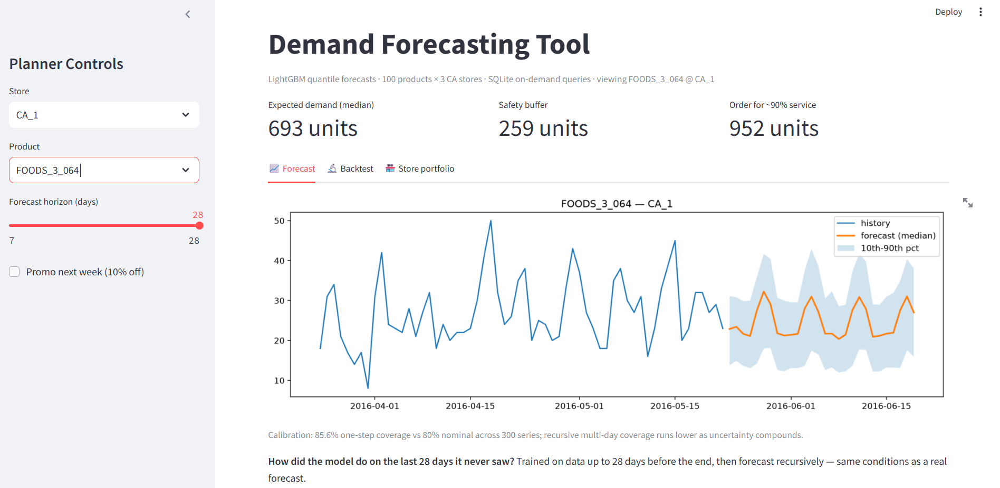
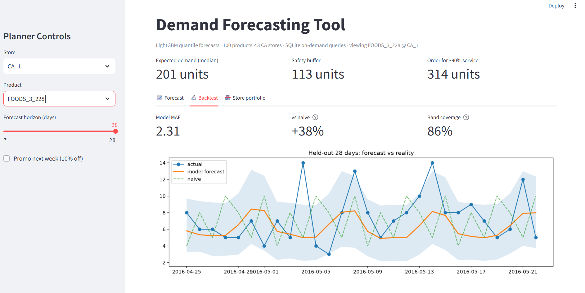
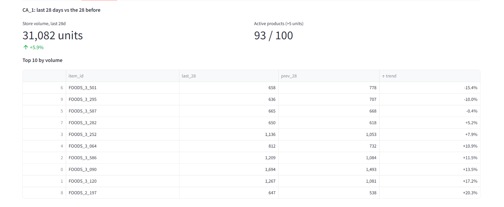
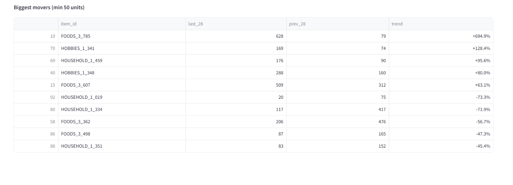

# Demand Forecasting System

End-to-end demand forecasting for retail: SQLite data layer, LightGBM quantile models,
and a deployed planning app with built-in backtesting.

**Live app:** https://demand-forecast-9pwroxcsikhv99ski78qld.streamlit.app
**Stack:** Python, SQL (SQLite), LightGBM, Optuna, Streamlit, pandas

## What it does

A planner picks a store and product and gets a 7 to 28 day demand forecast with a
10th to 90th percentile band, a recommended order quantity for a 90% service level,
and a backtest tab showing how the model performed on the last 28 days it never saw.
Data covers 100 products across 3 stores (about 580k daily sales records) from the
M5 Walmart dataset, queried on demand from SQLite rather than loaded into memory.

## Results

| Model | Test MAE | vs seasonal naive |
|---|---|---|
| Seasonal naive (copy last week) | 5.63 | baseline |
| Prophet (per series) | worse than naive | negative |
| LightGBM, tuned Tweedie objective | 3.98 | +29.3% |
| **LightGBM quantile (champion)** | **3.94** | **+30.1%** |

Evaluation is against a seasonal naive baseline across all 300 product-store series.
Earlier 10-product experiments used rolling-origin backtesting over three windows,
where the model beat the baseline in every fold (8.5% to 18%).

## Things I think are worth reading about

**Honest multi-step forecasting.** Standard lag features leak future information when
you evaluate a 28 day forecast, because day 20 "knows" real sales from day 13. The
recursive forecaster feeds its own predictions back in as history, the way production
would. This raised MAE from 5.99 to 6.95 on the initial 10-SKU build, and both numbers
are reported because the gap is the honest cost of forecasting reality.

**Calibrated uncertainty, audited.** The 10th to 90th percentile band comes from
quantile regression, not a symmetric std estimate. Empirical coverage was 85.6%
one-step (nominal 80%) and about 74% at 28 days recursive, since multi-step
uncertainty compounds. The app states this on the chart instead of hiding it.

**A null result, documented.** I expected a Tweedie objective to beat quantile loss
given the intermittent-demand literature, and it did not (3.98 vs 3.94 after 40
Optuna trials). Diagnosis: my top-100 product scope contains almost no intermittent
series, so the loss function's advantage had nothing to work on. Loss choice should
follow the demand profile of the actual catalog.

**SQL feature engineering, validated.** Lags and rolling means are computed with
window functions (LAG and AVG OVER with PARTITION BY) in SQLite, and the migrated
pipeline was checked row-for-row against the original pandas implementation before
switching engines.

## Architecture

M5 raw CSVs -> SQLite (sales / calendar / prices, indexed)
-> SQL window-function features
-> LightGBM q10 / q50 / q90 models
-> Streamlit app (on-demand queries, recursive forecasts, backtest tab)

## Running it

pip install -r requirements.txt
streamlit run app.py

The repo ships with forecast.db and trained models. To rebuild from scratch, download
the M5 dataset from Kaggle into data/ and run notebooks 01 through 04 in order.

## Known limitations

Future holidays are not fed into the forecast yet, promo effects come only through
price features, and recursive intervals are slightly overconfident. Next steps would
be conformal calibration for the bands, per-horizon models, and expanding beyond the
top-100 scope where Tweedie should earn its keep.